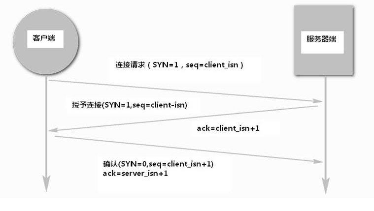

### HTTP

1. `HTTPS`的原理。

  答案：HTTPS(Secure Hypertext Transfer Protocol)安全超文本传输协议 它是一个安全通信通道，它基于HTTP开发，用于在客户计算机和服务器之间交换信息。它使用安全套接字层(SSL)进行信息交换，简单来说它是HTTP的安全版。 它是由Netscape开发并内置于其浏览器中，用于对数据进行压缩和解压操作，并返回网络上传送回的结果。HTTPS实际上应用了Netscape的安 全全套接字层(SSL)作为HTTP应用层的子层。(HTTPS使用端口443，而不是象HTTP那样使用端口80来和TCP/IP进行通信。)SSL使 用40 位关键字作为RC4流加密算法，这对于商业信息的加密是合适的。HTTPS和SSL支持使用X.509数字认证，如果需要的话用户可以确认发送者是谁。
  SSL的简介：
  SSL是Netscape公司所提出的安全保密协议，在浏览器(如Internet Explorer、Netscape Navigator)和Web服务器(如Netscape的Netscape Enterprise Server、ColdFusion Server等等)之间构造安全通道来进行数据传输，SSL运行在TCP/IP层之上、应用层之下，为应用程序提供加密数据通道，它采用了RC4、MD5 以及RSA等加密算法，使用40 位的密钥，适用于商业信息的加密。同时，Netscape公司相应开发了HTTPS协议并内置于其浏览器中，HTTPS实际上就是SSL over HTTP，它使用默认端口443，而不是像HTTP那样使用端口80来和TCP/IP进行通信。HTTPS协议使用SSL在发送方把原始数据进行加密，然 后在接受方进行解密，加密和解密需要发送方和接受方通过交换共知的密钥来实现，因此，所传送的数据不容易被网络黑客截获和解密。 然而，加密和解密过程需要耗费系统大量的开销，严重降低机器的性能，相关测试数据表明使用HTTPS协议传输数据的工作效率只有使用HTTP协议传输的十 分之一。假如为了安全保密，将一个网站所有的Web应用都启用SSL技术来加密，并使用HTTPS协议进行传输，那么该网站的性能和效率将会大大降低，而 且没有这个必要，因为一般来说并不是所有数据都要求那么高的安全保密级别，所以，我们只需对那些涉及机密数据的交互处理使用HTTPS协议，这样就做到鱼与熊掌兼得。总之不需要用https 的地方,就尽量不要用。
  参考：

    - [听大神说https和http区别](http://network.51cto.com/art/201502/465280.htm#rd?sukey=b0cb5c5b9e5013037ef7b04e199bc517bd68aadcae9a70034fef1f357950718e4662c416245563c75696d481de7c98d3)

2. `HTTP`和`HTTPS`的区别。

  答案：https协议需要到ca申请证书，一般免费证书很少，需要交费。 http是超文本传输协议，信息是明文传输，https 则是具有安全性的ssl加密传输协议 http和https使用的是完全不同的连接方式用的端口也不一样,前者是80,后者是443。 http的连接很简单,是无状态的 HTTPS协议是由SSL+HTTP协议构建的可进行加密传输、身份认证的网络协议 要比http协议安全 HTTPS解决的问题： 1 . 信任主机的问题. 采用https 的server 必须从CA 申请一个用于证明服务器用途类型的证书. 改证书只有用于对应的server 的时候,客户度才信任次主机. 所以目前所有的银行系统网站,关键部分应用都是https 的. 客户通过信任该证书,从而信任了该主机. 其实这样做效率很低,但是银行更侧重安全. 这一点对我们没有任何意义,我们的server ,采用的证书不管自己issue 还是从公众的地方issue, 客户端都是自己人,所以我们也就肯定信任该server. 2 . 通讯过程中的数据的泄密和被窜改 1. 一般意义上的https, 就是 server 有一个证书. a) 主要目的是保证server 就是他声称的server. 这个跟第一点一样. b) 服务端和客户端之间的所有通讯,都是加密的. i. 具体讲,是客户端产生一个对称的密钥,通过server 的证书来交换密钥. 一般意义上的握手过程. ii. 加下来所有的信息往来就都是加密的. 第三方即使截获,也没有任何意义.因为他没有密钥. 当然窜改也就没有什么意义了. 2. 少许对客户端有要求的情况下,会要求客户端也必须有一个证书. a) 这里客户端证书,其实就类似表示个人信息的时候,除了用户名/密码, 还有一个CA 认证过的身份. 应为个人证书一般来说上别人无法模拟的,所有这样能够更深的确认自己的身份. b) 目前少数个人银行的专业版是这种做法,具体证书可能是拿U盘作为一个备份的载体.像我用的交通银行的网上银行就是采取的这种方式。 HTTPS 一定是繁琐的. a) 本来简单的http协议,一个get一个response. 由于https 要还密钥和确认加密算法的需要.单握手就需要6/7 个往返. i. 任何应用中,过多的round trip 肯定影响性能. b) 接下来才是具体的http协议,每一次响应或者请求, 都要求客户端和服务端对会话的内容做加密/解密. i. 尽管对称加密/解密效率比较高,可是仍然要消耗过多的CPU,为此有专门的SSL 芯片. 如果CPU 信能比较低的话,肯定会降低性能,从而不能serve 更多的请求.

  参考：

    - 

3. `TCP/IP`四层模型。

  答案：TCP/IP模型实际上是OSI模型的一个浓缩版本，它只有四个层次：
  1. 应用层，对应着OSI的应用层、表示层、会话层
  2. 传输层，对应着OSI的传输层
  3. 网络层，对应着OSI的网络层
  4. 网络接口层，对应着OSI的数据链路层和物理层
  OSI模型的网络层同时支持面向连接和无连接的通信，但是传输层只支持面向连接的通信；TCP/IP模型的网络层只提供无连接的服务，但是传输层上同时提供两种通信模式。

4. `TCP`，`IP`， `HTTP`的相关概念。

  答案：国际标准化组织（ISO）制定了OSI(开放式系统互联)模型，该模型定义了不同计算机互联的标准，是设计和描述计算机网络通信的基本框架。OSI模型把网络通信的工作分为7层，分别是物理层、数据链路层、网络层、传输层、会话层、表示层和应用层。(网络中各结点都有相同的层次;不同结点相同层次具有相同的功能;同一结点相邻层间通过接口通信;每一层可以使用下层提供的服务，并向上层提供服务;不同结点的同等层间通过协议来实现对等层间的通信)(对等层通信的实质：对等层实体之间虚拟通信；下层向上层提供服务；实际通信在最底层完成；发送方数据由最高层逐渐向下层传递，到接收方数据由最低层逐渐向高层传递。)(OSI参考模型中，对等层协议之间交换的信息单元统称为协议数据单元(PDU，Protocol Data Unit)。而传输层及以下各层的PDU另外还有各自特定的名称：应用层--数据（Data）传输层——数据段（Segment）网络层——分组（数据包）（Packet）数据链路层——数据帧（Frame）物理层——比特（Bit）)

  不同的协议在最初OSI模型中的位置:为方便记忆可以将七层从高到低视为：All People Seem To Need Data Processing。每一个大写字母与七层名称头一个字母相对应。

  

  “IP”代表网际协议，TCP和UDP使用该协议从一个网络传送数据包到另一个网络。把IP想像成一种高速公路，它允许其它协议在上面行驶并找到到其它电脑的出口。TCP和UDP是高速公路上的“卡车”，它们携带的货物就是像HTTP，文件传输协议FTP这样的协议等。

  IP的概念

  英文为Internet Protocol，翻译成网际协议，位于网络层。因为几乎所有使用网络的系统都会用到IP协议。把各种数据包传送给对方。如果要保证确定传送到对方那里，则需要满足各类条件，其中最重要的两个条件是IP地址和MAC地址。(IP地址：指明了节点被分配到的地址,MAC地址：是指网卡所属的固定地址;IP地址可变换，但MAC地址基本上不会更改。)

  TCP协议的概念与作用

  英文为Transmission Control Protocol ，翻译成传输控制协议，位于传输层。它是提供可靠的字节流服务。所谓的字节流服务指的是，为了方便传输，将大块数据分割成以报文段为单位的数据包进行管理.因为它能够把数据准确可靠地传送给对方。总而言之，TCP协议就是为了 更容易传送大数据才把数据分割，而且TCP协议能够确认数据  最终是否送达对方。它采用了三次握手策略,也就是用TCP协议 把数据包送出去后，它不会对传送后的情况置之不理，它一定会想对方确认是否成功送达。

  http协议

  HTTP协议即超文本传送协议(Hypertext Transfer Protocol )，建立在TCP协议之上，位于应用层。HTTP连接最显著的特点是客户端发送的每次请求都需要服务器回送响应，在请求结束后，会主动释放连接。从建立连接到关闭连接的过程称为“一次连接”。简单快速：客户向服务器请求服务时，只需传送请求方法和路径。请求方法常用的有GET、HEAD、POST。每种方法规定了客户与服务器联系的类型不同。由于HTTP协议简单，使得HTTP服务器的程序规模小，因而通信速度很快。HTTP允许传输任意类型的数据对象。正在传输的类型由Content-Type加以标记。还有HTTP协议是无状态协议。无状态是指协议对于事务处理没有记忆能力。

  举个例子：
  首先是，我想访问网站，将域名发送给DNS去解析，DNS解析后将网站的IP地址返回给客户端，然后通过IP地址发起HTTP请求。HTTP此时的作用是 生成针对目标WEB服务器（我们这里指的是网站的服务器）的HTTP请求报文，然后将请求报文传送给传输层，此时为了方便通信，TCP会将HTTP请求报文  分割成报文段，这些报文段会有一个序号，这里的报文段哪一个先发送哪一个先到达，它们是按序传送的。只要建立起TCP连接，客户端与服务器之间的报文交换就不会丢失，不会被破坏，也不会在接收时出现错序。接着到了网络层，此时IP协议的职责是，搜索对方的地址，一边中转一边传送。然后找到了服务器的位置，此时服务器的传输层中 TCP的职责是  接收到对方传送过来的报文段后，对其进行重组，这里的重组是按序号进行重组的。然后到了服务器的应用层，HTTP会对客户端请求的内容进行处理。处理完后，服务器同样会利用TCP/IP通信协议向客户端进行回传响应。最后客户端收到响应后，将内容输出页面显示。即完成了一次HTTP事务。

5. `TCP`三次握手的过程。

  答案：
  建立起一个TCP连接需要经过“三次握手”：

  第一次握手：客户端发送syn包(syn=j)到服务器，并进入SYN_SEND状态，等待服务器确认；

  第二次握手：服务器收到syn包，必须确认客户的SYN（ack=j+1），同时自己也发送一个SYN包（syn=k），即SYN+ACK包，此时服务器进入SYN_RECV状态；

  第三次握手：客户端收到服务器的SYN＋ACK包，向服务器发送确认包ACK(ack=k+1)，此包发送完毕，客户端和服务器进入ESTABLISHED状态，完成三次握手。

  握手过程中传送的包里不包含数据，三次握手完毕后，客户端与服务器才正式开始传送数据。理想状态下，TCP连接一旦建立，在通信双方中的任何一方主动关闭连接之前，TCP 连接都将被一直保持下去。断开连接时服务器和客户端均可以主动发起断开TCP连接的请求，断开过程需要经过“四次握手”（过程就不细写了，就是服务器和客户端交互，最终确定断开）.

  参考：

    - 

6. `TCP`和`UDP`的区别。

  答案：你应该能理解，TCP和UDP是FTP，HTTP和SMTP之类使用的传输层协议。虽然TCP和UDP都是用来传输其他协议的，它们却有一个显著的不同：TCP提供有保证的数据传输，而UDP不提供。这意味着TCP有一个特殊的机制来确保数据安全的不出错的从一个端点传到另一个端点，而UDP不提供任何这样的保证。
  HTTP(超文本传输协议)是利用TCP在两台电脑(通常是Web服务器和客户端)之间传输信息的协议。客户端使用Web浏览器发起HTTP请求给Web服务器，Web服务器发送被请求的信息给客户端。

  参考：

    - [TCP和UDP之间的区别](http://feinibuke.blog.51cto.com/1724260/340272/)

7. `TCP`的拥塞控制。

  答案：

  参考：

    - [ TCP的拥塞控制](http://blog.csdn.net/sicofield/article/details/9708383)

8. `HTTP`常见的状状态码。

  答案：常用的http转态码如下
  1XX--提示信息
  100--继续
  101--更改协议
  2XX--成功
  200--客户端请求成功
  3XX--重定向
  301--永久转移
  302--暂时转移
  304--未修改
  4XX--客户端错误
  400--错误的请求
  401--访问被拒绝
  402--禁止访问
  404--未找到
  5XX--服务端错误
  500--服务器内部错误
  503--服务不可用
  504--网关超时

  参考：

    - [HTTP状态码大全](http://www.cnblogs.com/lxinxuan/archive/2009/10/22/1588053.html)
    - [HTTP状态码](http://baike.baidu.com/link?url=AH6tSqJ3BggCDyxm799uHviR-j9xVj9BMWq5NzZi6uLzBenVRzNja8wJqb9EHvevL7pdxgaKuBL90RHpPXXz0_)

9. `HTTP`头部包含的信息及作用。

  答案：

  参考：

    - 

10. `HTTP`缓存控制的原理。

  答案：

  参考：

    - [HTTP协议：缓存](http://kb.cnblogs.com/page/166267/)

11. `SEO`是什么，有什么最佳实践？

  答案：

  参考：

    - [浅谈前端与SEO](http://uxc.360.cn/archives/984.html)

12. `POST`和`GET`的异同

  答案：1. get是从服务器上获取数据，post是向服务器传送数据。2. get是把参数数据队列加到提交表单的ACTION属性所指的URL中，值和表单内各个字段一一对应，在URL中可以看到。post是通过HTTP post机制，将表单内各个字段与其内容放置在HTML HEADER内一起传送到ACTION属性所指的URL地址。用户看不到这个过程。 3. 对于get方式，服务器端用Request.QueryString获取变量的值，对于post方式，服务器端用Request.Form获取提交的数据。 4. get安全性非常低，post安全性较高。但是执行效率却比Post方法好。
建议： 1、get方式的安全性较Post方式要差些，包含机密信息的话，建议用Post数据提交方式； 2、在做数据查询时，建议用Get方式；而在做数据添加、修改或删除时，建议用Post方式。

  参考：

    - 
